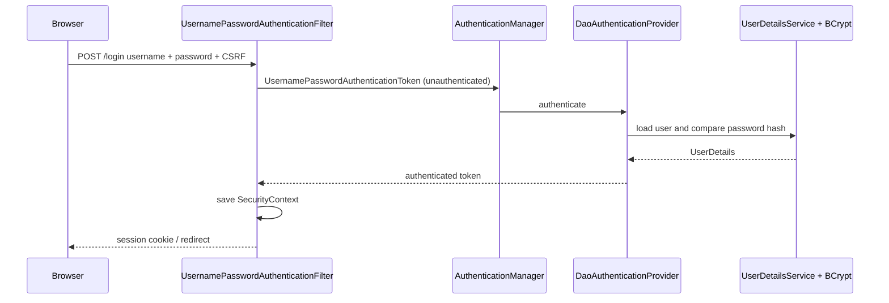
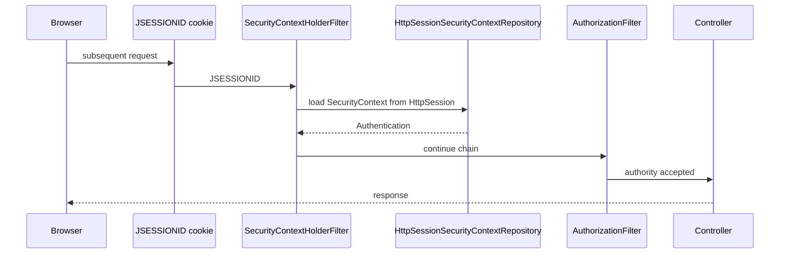
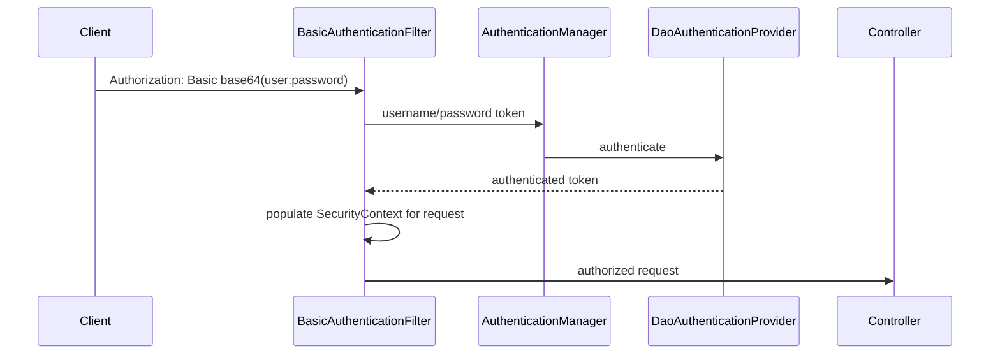
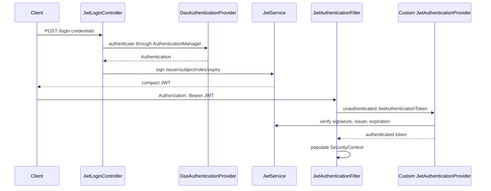
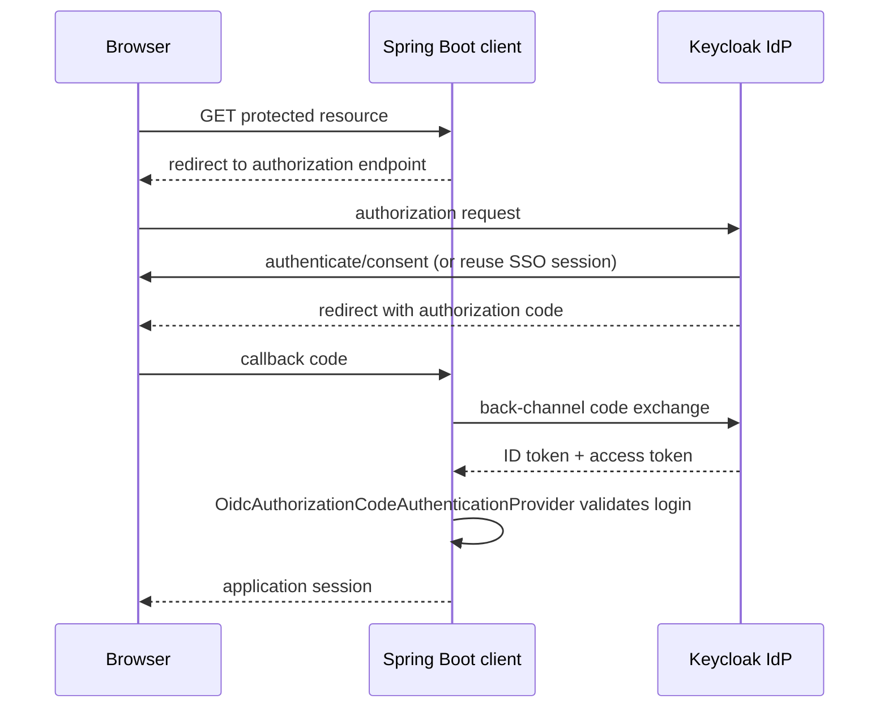
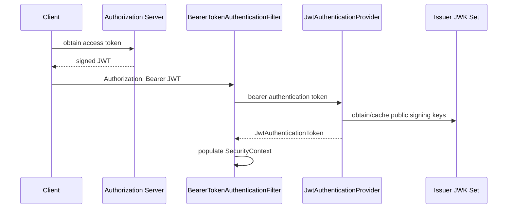
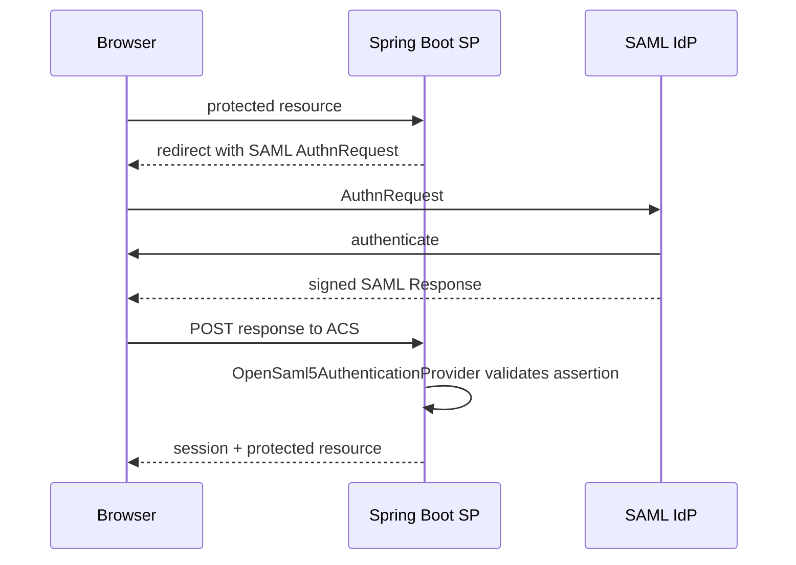
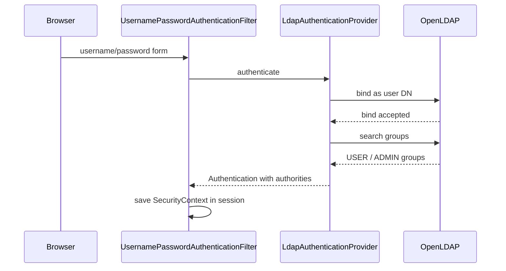
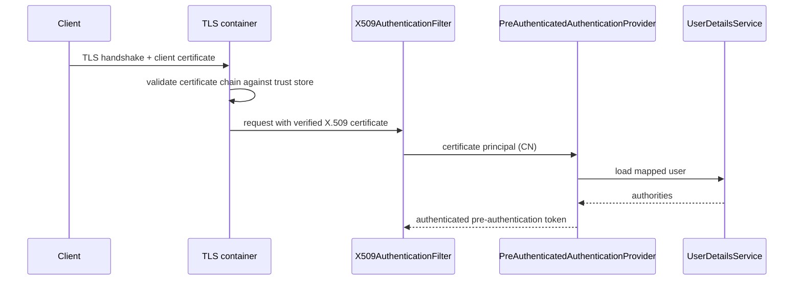
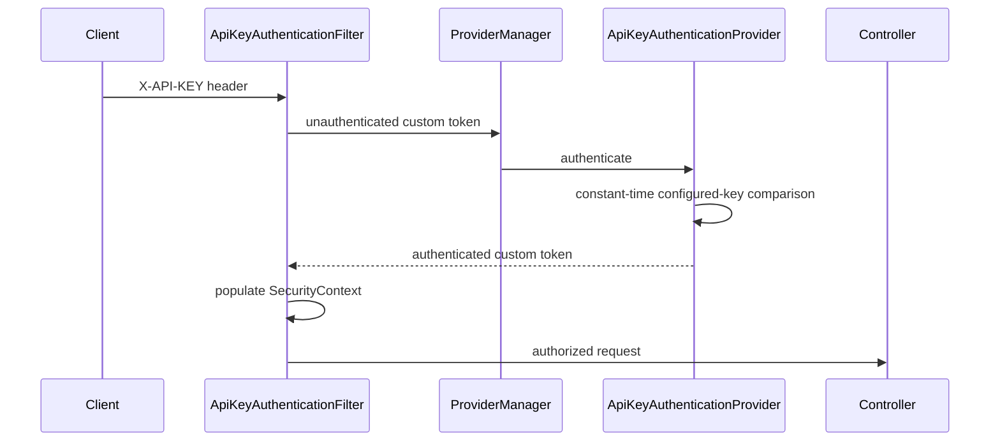

# Authentication request flows

The invariant is: request enters a `SecurityFilterChain`; an authentication filter creates an unauthenticated token; `AuthenticationManager` selects an `AuthenticationProvider`; successful validation returns authenticated `Authentication`; Spring places it in `SecurityContext`; authorization runs before the controller.

## Username/password

## Session

## HTTP Basic

## Custom JWT

## OAuth 2.0 / OIDC login and SSO

## OAuth 2.0 JWT resource server

## SAML 2.0

## LDAP

## mTLS / X.509

## Custom API key

